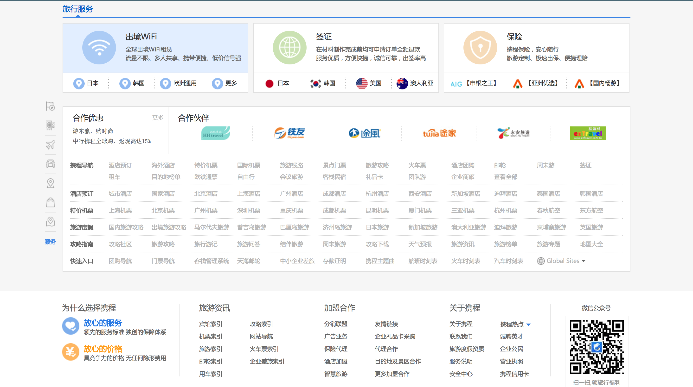

# HTML 第一阶段考试

## 考前说明

- 考试网站：[携程旅游](http://www.ctrip.com/)
- 考试时间：210分钟（3小时30分时）
- 评分标准：
  - 网站整体布局（30%）
  - 功能实现情况（30%）
  - 注释语句书写（20%）
  - 是否遵循 HTML 书写规范（20%）
    - 命名全部采用英文，发现纯数字或中文为零分
    - 正确表达父子级关系
    - 嵌套原则
- 完成后提交地址：
  - lipeng@yztctech.com

## 网站说明

#### 顶部导航栏

**注意：其中下方广告栏处可以使用图片**

顶部搜索栏只需要完成鼠标移入后出现颜色改变即可。

下方导航栏处，只需要实现一个部分内容即可。

#### 中部主体内容

需要注意，需要设置左部存在一个固定定位的菜单栏，只需要实现位置即可，不需要实现具体功能。

#### 中部主体内容

需要注意，需要完成鼠标移入对应菜单中，中间部分内容透明度发生改变的效果。

#### 中部主体内容

需要注意，需要实现，鼠标在某一内容之上悬停的时候，下方出现阴影的效果。

#### 中部主体内容

需要注意，需要完成，鼠标移入对应内容，发生背景颜色发生改变的效果。

## 温馨提示

* 布局的时候，可以先采用整块布局的方式来完成。在整体布局之后只需要针对对应小块内部的内容来进行书写即可。
* 整体布局之后，再开始进行对应小块内容的书写。同时需要注意，将每一个子级内容的书写固定在对应父级块的内部。
* 最终实现以当日最后邮件为准，如果时间不够，可以课下完成，记得最后提交即可。

> 我猜你们看到现在，一定心理默念了句“握草”，但是，请不要灰心，我相信你们！
>
> 加油！

